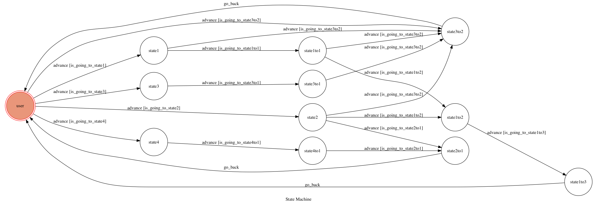

# TOC Project 2017

Template Code for TOC Project 2017

A telegram bot based on a finite state machine

## Setup

### Prerequisite
* Python 3.4.3

#### Install Dependency
```sh
py -m pip install transitions==0.5.0
py -m pip install Flask==0.12.1
py -m pip install pygraphviz==1.3.1
py -m pip install python-telegram-bot==5.3.0
```


### Secret Data

`API_TOKEN` and `WEBHOOK_URL` in app.py **MUST** be set to proper values.
Otherwise, you might not be able to run your code.

### Run Locally
You can either setup https server or using `ngrok` as a proxy.

**`ngrok` would be used in the following instruction**

```sh
ngrok http 5000
```

After that, `ngrok` would generate a https URL.

You should set `WEBHOOK_URL` (in app.py) to `your-https-URL/hook`.

#### Run the sever

```sh
py app.py
```

## Finite State Machine


## Usage
The initial state is set to `user`.

Every time `user` state is triggered to `advance` to another state, it will `go_back` to `user` state after the bot replies corresponding message.

* user
	* Input: "hello"
		* Reply: "nice to meet you"

	* Input: "hey bitch"
		* Reply: "fuck off"
	* Input: "yo whats up"
		* Reply: "whats up"
	* Input: "whats your name"
		* Reply: "my name is secret"
* state1
    * Input: "how much"
		* Reply: "im not a bitch"
	* Input: "show me what you got"
		* Reply: a photo
* state2
    * Input: "show me what you got"
		* Reply: a photo
	* Input: "you look like a whore"
		* Reply: "you dirty pig, get away from me"
	* Input: "dont be so mean"
		* Reply: "i'll call the police"
* state3
    * Input: "5000?"
		* Reply: "i'm not cheap!10000!"
* state4
    * Input: "i wanna know you"
		* Reply: "i dont wanna know you"
* state1to1
    * Input: "you look like a whore"
		* Reply: "you dirty pig, get away from me"
	* Input: "show me what you got"
		* Reply: a photo
* state1to2
    * Input: "no"
		* Reply: "fuck you"
* state3to1
    * Input: "show me what you got"
		* Reply: a photo
* state4to1
    * Input: "dont be so mean"
		* Reply: "i'll call the police"

## Author
[chesterhuang](https://github.com/chesteran)
